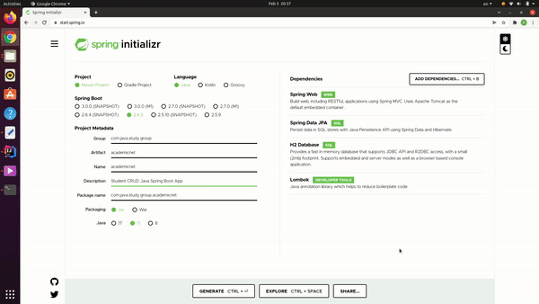

## Video 1

### Step 1

First we go to the [spring initializr](https://start.spring.io/) website to generate the project.
After that fill in the data of the project the screen will look like this.

Then we can select generate the code and download the project.

We unzip the file and open the project with InteliJ (or any other IDE of you choice).

### Step 2
From this moment we have an executable application but, we need to create a controller and configure the index file of the application.
We create a new package called **controller** and inside of that package we create a class **StudentController**.
We put the annotation @RestController indicating that it is ready to handle web requests.
The annotation @requestmap simply put, is used to map web requests to Spring Controller methods.

    @RestController
    @RequestMapping("/students")
    public class StudentController {

        @GetMapping
        public String getInfo (){
            return "message";
        }
    }

